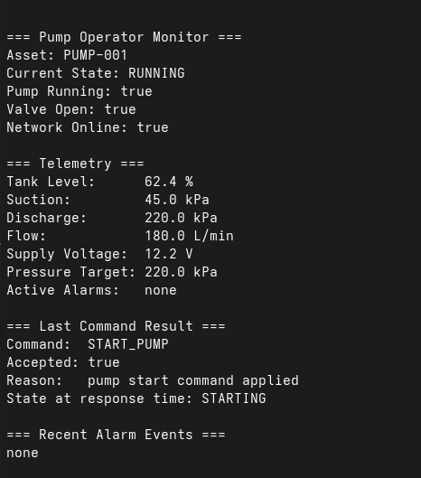
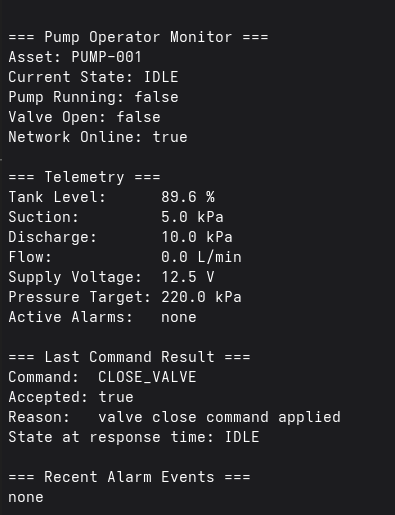
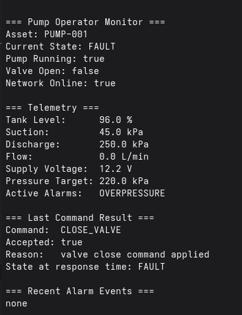
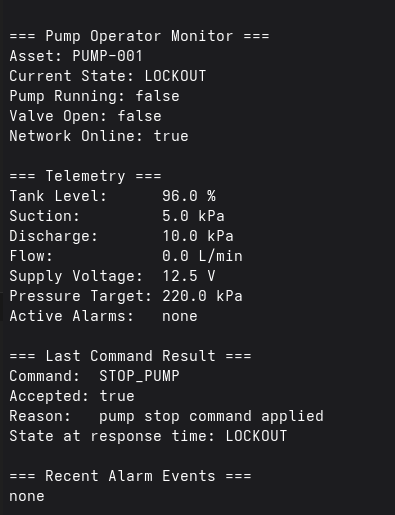

# RESULTS.md

## Purpose

This document records the current outcomes of the Lua Remote Pump Monitor project.

It summarizes what has been implemented, what scenarios have been tested, and what evidence can be added to the repository.

---

## Project Status

Current status: **working end-to-end simulation**

The project currently demonstrates:

- local pump and valve simulation
- state-machine-based operating state interpretation
- alarm raise/clear logic
- safe remote command handling
- MQTT publishing of state, telemetry, alarms, and command results
- operator-side monitoring through a Lua terminal monitor
- operator command injection through a Lua command sender or MQTT client tools

---

## Implemented Features

### Plant simulation
- pump on/off behavior
- valve open/close behavior
- flow simulation
- suction pressure simulation
- discharge pressure simulation
- tank level drain behavior
- supply voltage behavior
- pressure target support

### State machine
- `IDLE`
- `STARTING`
- `RUNNING`
- `WARNING`
- `FAULT`
- `LOCKOUT`

### Alarm engine
- `LOW_TANK_LEVEL`
- `NO_FLOW_WHILE_RUNNING`
- `OVERPRESSURE`
- `LOW_VOLTAGE`
- `COMMS_LOST`

### Commands
- `START_PUMP`
- `STOP_PUMP`
- `OPEN_VALVE`
- `CLOSE_VALVE`
- `SET_PRESSURE_TARGET`
- `ACK_ALARM`
- `RESET_FAULT`

### MQTT
- state publishing
- telemetry publishing
- alarm event publishing
- command result publishing
- command subscription and processing

### Operator tools
- live operator monitor
- command sender script

---

## Tested Scenarios

### 1. Normal startup
**Scenario**
- open valve
- start pump

**Expected**
- state transitions from `IDLE -> STARTING -> RUNNING`
- flow becomes positive
- pressure rises to the configured target
- telemetry reflects normal operation

**Observed**
- working




---

### 2. Normal stop
**Scenario**
- system running normally
- stop pump

**Expected**
- state returns to `IDLE`
- flow drops to zero
- system does not enter `LOCKOUT`

**Observed**
- working



---

### 3. Pressure target update
**Scenario**
- system running normally
- send `SET_PRESSURE_TARGET`

**Expected**
- command accepted
- telemetry reflects updated pressure target
- discharge behavior follows new target

**Observed**
- working

---

### 4. Overpressure / blocked discharge fault
**Scenario**
- start pump normally
- close valve while pump is running

**Expected**
- discharge pressure rises abnormally
- `OVERPRESSURE` alarm is raised
- state transitions to `FAULT`

**Observed**
- working

**Image placeholder**


---

### 5. Lockout after critical fault
**Scenario**
- trigger critical fault
- stop pump

**Expected**
- system enters `LOCKOUT`

**Observed**
- working

**Image placeholder**


---

## MQTT Verification

The following MQTT flows were verified:

### Published by simulator
- `pump/PUMP-001/state`
- `pump/PUMP-001/telemetry`
- `pump/PUMP-001/alarms`
- `pump/PUMP-001/command_result`

### Consumed by simulator
- `pump/PUMP-001/commands`

### Example verification method
A subscriber such as:

```bash
mosquitto_sub -h 127.0.0.1 -v -t 'pump/PUMP-001/#'
```
was used to confirm end-to-end traffic.